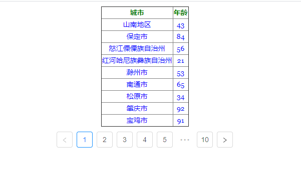

# React Hook分页高阶组件

实现列表的分页功能,只需要将自定义的组件使用该高阶组件封装,传入数据源即可对列表进行分页

## 技术
- 脚手架采用umi搭建  https://umijs.org/docs/getting-started#environment-setup

      yarn create paginateHoc

- 基于蚂蚁金服的Pagination组件进行再次封装的高阶组件

## 使用

```
  const PaginationCom = paginateHoc(List)  //List为自定义组件,仅用于展示不包含逻辑
  const [dataSource, setDatasource] = useState([])
  useEffect(() => {
      getData()  //获取Mock数据  在文件mock/api.js
  }, [])
  //需要传入的数据
  const data = {
      dataSource: dataSource,  //数据源
      pageCount: dataSource.length, //总记录数
      pageSize: 10,  //每页条数
      defaultCurrent: defaultCurrent,  //默认的当前页数
      setDefaultCurrent
  }
  //异步获取数据
  const getData = async () => {
      const res = await axios.get('api/tags')
      console.log({res})
      setDatasource(res.data.list)
  }


  return (
          <PaginationCom {...data} />
  );
```
## 运行

    yarn 
    yarn start 

浏览 http://localhost:8000

查看模拟数据 http://localhost:8000/api/tags

## 效果图

 